# 開発ワークフロー

## システム構成

```
Windows (Antigravity)
  │
  ├─ gh codespace ssh ──→ GitHub Codespaces (x86_64)
  │                         クロスコンパイル → aarch64バイナリ
  │                         scp → EC2
  │
  └─ Remote SSH ────────→ AWS EC2 arm64 (Graviton)
                            bridge.py (port 8080/8765)
                            gpio_shim.so + gpio_led_button
                              │
                              └─ ポートフォワード → Antigravity Simple Browser
                                                    Virtual Hardware Panel
```

---

## シーケンス図

```mermaid
sequenceDiagram
    participant Dev as 開発者
    participant Win as Windows<br/>(Antigravity)
    participant GH as GitHub<br/>(Codespaces)
    participant EC2 as AWS EC2<br/>(arm64 Graviton)
    participant Panel as Hardware Panel<br/>(ブラウザ)

    rect rgb(20, 40, 70)
        Note over Dev,EC2: 【準備】初回のみ
        Dev->>GH: GitHubアカウント作成
        Dev->>GH: ExperimentalDevEnv リポジトリを fork / clone
        Dev->>Win: Antigravity (VSCode互換) インストール
        Dev->>Win: AWS CLI インストール (winget install Amazon.AWSCLI)
        Dev->>EC2: AWSアカウント作成
        Dev->>EC2: EC2インスタンス作成<br/>(Ubuntu 24.04 arm64, t4g.small, ap-southeast-2)
        EC2-->>Dev: キーペア vibecode-graviton.pem ダウンロード
        Dev->>Win: aws configure<br/>(Access Key / Secret / ap-southeast-2)
        Dev->>Win: ~/.ssh/vibecode-graviton.pem を配置
    end

    rect rgb(20, 60, 40)
        Note over Dev,GH: 【開発環境起動】開発開始時
        Dev->>Win: gh codespace list で名前確認
        Dev->>Win: gh codespace ssh --codespace <name>
        Win->>GH: Codespace VM 起動 + SSH 接続
        GH-->>Dev: Codespaces ターミナル ready
        Dev->>GH: git pull
        Note over GH: 初回のみ: cat > ~/.ssh/vibecode-graviton.pem<br/>bash setup_ssh.sh <EC2_IP>
    end

    rect rgb(50, 30, 70)
        Note over Dev,GH: 【開発・編集・ビルド】
        Dev->>GH: C / Python / HTML ソース編集
        Dev->>GH: cd cuse-stubs && make cross
        GH-->>Dev: aarch64 バイナリ生成<br/>gpio_shim.so / gpio_led_button<br/>cuse_i2c / vl53l0x_read
        Dev->>GH: git add && git commit && git push
    end

    rect rgb(70, 40, 20)
        Note over Dev,Win: 【EC2 起動】使用開始時
        Dev->>Win: .\\ec2.ps1 start
        Win->>EC2: aws ec2 start-instances
        EC2-->>Win: Public IP アドレス
        Win->>Win: ~/.ssh/config の HostName を自動更新
        Win-->>Dev: "Connect: ssh vibecode-graviton"
    end

    rect rgb(20, 60, 60)
        Note over GH,EC2: 【成果物デプロイ】ビルド後
        Dev->>GH: make deploy EC2=vibecode-graviton
        GH->>EC2: scp gpio_shim.so
        GH->>EC2: scp gpio_led_button
        GH->>EC2: scp cuse_i2c / vl53l0x_read
        GH->>EC2: scp -r web-bridge/
        EC2-->>GH: "Deploy complete"
    end

    rect rgb(40, 60, 30)
        Note over Dev,Panel: 【実行】
        Dev->>EC2: ssh vibecode-graviton (ターミナル①)
        Dev->>EC2: ~/venv/bin/python3 ~/web-bridge/bridge.py
        EC2-->>Dev: [bridge] /tmp/hw_sim.sock<br/>[bridge] ws://0.0.0.0:8765<br/>[bridge] http://0.0.0.0:8080

        Dev->>EC2: ssh vibecode-graviton (ターミナル②)
        Dev->>EC2: LD_PRELOAD=~/gpio_shim.so ~/gpio_led_button
        EC2-->>Dev: [gpio_shim] loaded
        loop LED 自動点滅 (100ms毎)
            EC2->>EC2: Unix socket 経由で bridge へ LED 状態送信
        end
    end

    rect rgb(60, 50, 20)
        Note over Dev,Panel: 【操作・観察】
        Dev->>Win: Antigravity: Remote-SSH → vibecode-graviton
        Win->>EC2: SSH 接続 + ポート自動転送<br/>(8080: HTTP / 8765: WebSocket)
        Dev->>Win: PORTS タブ → 8080 を Simple Browser で開く
        Win->>Panel: http://localhost:8080
        Panel->>EC2: WebSocket 接続 (ws://localhost:8765)
        EC2-->>Panel: LED 状態をリアルタイム送信
        Panel-->>Dev: LED 点滅をパネルで可視化

        Dev->>Panel: PUSH ボタンをクリック
        Panel->>EC2: {"type":"button","line":17,"value":1}
        EC2-->>Panel: LED トグル → パネル反映
    end
```



---

## コマンドリファレンス

| フェーズ | 場所 | コマンド |
|---|---|---|
| EC2 起動 | Windows PS | `.\ec2.ps1 start` |
| EC2 停止 | Windows PS | `.\ec2.ps1 stop` |
| EC2 状態確認 | Windows PS | `.\ec2.ps1 status` |
| Codespaces SSH (起動も兼ねる) | Windows PS | `gh codespace ssh --codespace <name>` |
| クロスコンパイル | Codespaces | `cd cuse-stubs && make cross` |
| デプロイ | Codespaces | `make deploy EC2=vibecode-graviton` |
| ブリッジ起動 | EC2 | `~/venv/bin/python3 ~/web-bridge/bridge.py` |
| GPIO デモ | EC2 | `LD_PRELOAD=~/gpio_shim.so ~/gpio_led_button` |
