# 開発ワークフロー

SSH/scp + adb を用いたデプロイベースのワークフローです。

## システム全体図

```
Windows (Antigravity)
  │
  ├─ gh codespace ssh ──→ GitHub Codespaces (x86_64)
  │                         クロスコンパイル → aarch64 バイナリ
  │                         (sensor_demo / shims / cuse_i2c)
  │
  ├─ Codespaces → scp ──→ AWS EC2 arm64 (Graviton)  ← シミュレーション
  │                         bridge.py (port 8080/8765)
  │                         cuse_i2c (/dev/i2c-1)
  │                         LD_PRELOAD="gpio_shim.so spi_shim.so" sensor_demo
  │                           └─ ポートフォワード → Virtual Hardware Panel
  │
  ├─ Codespaces → cp → Windows → adb push → Raspberry Pi 5 (arm64)  ← 実機
  │                                            sensor_demo (シムなし、実 H/W)
  │                                            → 実 LED / ボタン / OLED / RFID
  │
  └─ Remote SSH ────────→ EC2 / RasPi5（編集・観察用）
```

---

## 開発シーケンス図

```mermaid
sequenceDiagram
    participant Dev as 開発者
    participant Win as Windows<br/>(Antigravity)
    participant GH as GitHub<br/>(Codespaces)
    participant EC2 as AWS EC2<br/>(シミュレータ)
    participant Panel as Virtual<br/>Hardware Panel
    participant RPi as Raspberry Pi 5<br/>(実機)

    rect rgb(50, 30, 70)
        Note over Dev,GH: 【開発・編集・ビルド】
        Dev->>GH: ソース編集 (app/, cuse-stubs/)
        Dev->>GH: cd /workspaces/AgentCockpit && make cross
        GH-->>Dev: aarch64 バイナリ生成<br/>(sensor_demo, gpio_shim.so, spi_shim.so, cuse_i2c, ...)
    end

    rect rgb(70, 40, 20)
        Note over Dev,EC2: 【EC2】起動 + デプロイ
        Dev->>Win: C:\VibeCode\ec2.ps1 start
        Win->>EC2: 起動 + IP 取得 + SSH config 更新 + 自動 git pull
        Dev->>GH: make deploy-ec2 EC2=vibecode-graviton
        GH->>EC2: scp sensor_demo / shims / cuse_i2c / web-bridge/
    end

    rect rgb(40, 60, 30)
        Note over Dev,EC2: 【EC2】シミュレータ起動（3 プロセス）
        Dev->>EC2: ssh vibecode-graviton (①)
        Dev->>EC2: ~/venv/bin/python3 ~/web-bridge/bridge.py
        EC2-->>Dev: [bridge] :8080 / :8765 / /tmp/hw_sim.sock
        Dev->>EC2: ssh vibecode-graviton (②)
        Dev->>EC2: sudo ~/cuse_i2c -f --devname=i2c-1
        EC2-->>Dev: /dev/i2c-1 created
        Dev->>EC2: ssh vibecode-graviton (③)
        Dev->>EC2: LD_PRELOAD="~/gpio_shim.so ~/spi_shim.so" ~/sensor_demo
    end

    rect rgb(60, 50, 20)
        Note over Dev,Panel: 【EC2】操作・観察
        Dev->>Win: Antigravity: Remote-SSH → vibecode-graviton
        Win->>EC2: SSH 接続 + ポート自動転送 (8080/8765)
        Dev->>Win: PORTS → 8080 を Simple Browser で開く
        EC2-->>Panel: LED / OLED framebuffer をリアルタイム送信
        Dev->>Panel: PUSH (system ON) / Tap Card
        Panel->>EC2: bridge 経由でアプリへ反映
        EC2-->>Panel: OLED に UID 表示 + LED2 フラッシュ
    end

    rect rgb(20, 50, 60)
        Note over Dev,RPi: 【RasPi5】デプロイ
        Dev->>Win: C:\VibeCode\raspi.ps1 deploy
        Win->>GH: gh codespace cp で取得
        Win->>RPi: adb push sensor_demo / shims / cuse_i2c / ...
    end

    rect rgb(30, 60, 50)
        Note over Dev,RPi: 【RasPi5】実機実行
        Dev->>Win: adb shell
        Dev->>RPi: ~/sensor_demo
        RPi->>RPi: 実 GPIO / 実 I2C OLED / 実 SPI RFID を直接制御
    end

    rect rgb(50, 60, 30)
        Note over Dev,RPi: 【RasPi5】操作・観察
        Dev->>RPi: 物理ボタン (GPIO17) を押す
        RPi-->>Dev: 実 LED (GPIO18/24) / 実 OLED が反応
        Dev->>RPi: RFID カードをかざす
        RPi-->>Dev: OLED に UID 表示 + LED2 フラッシュ
    end
```



---

## コマンドリファレンス

| フェーズ | 場所 | コマンド |
|---|---|---|
| GitHub CLI インストール | Windows PS | `winget install GitHub.cli` |
| GitHub CLI 認証 | Windows PS | `gh auth login` |
| AWS CLI インストール | Windows PS | `winget install Amazon.AWSCLI` |
| AWS CLI 認証設定 | Windows PS | `aws configure` |
| ADB (PlatformTools) インストール | Windows PS | `winget install Google.PlatformTools` |
| EC2 起動 | Windows PS | `C:\VibeCode\ec2.ps1 start` |
| EC2 停止 | Windows PS | `C:\VibeCode\ec2.ps1 stop` |
| EC2 状態確認 | Windows PS | `C:\VibeCode\ec2.ps1 status` |
| Codespaces SSH | Windows PS | `gh codespace ssh --codespace <name>` |
| クロスコンパイル | Codespaces | `make cross` |
| EC2 へデプロイ | Codespaces | `make deploy-ec2 EC2=vibecode-graviton` |
| RasPi5 へデプロイ | Windows PS | `C:\VibeCode\raspi.ps1 deploy` |
| EC2 シェル | Windows PS | `ssh vibecode-graviton` |
| RasPi5 シェル | Windows PS | `adb shell` |
| ブリッジ起動 | EC2 | `~/venv/bin/python3 ~/web-bridge/bridge.py` |
| I2C スタブ起動 | EC2 | `sudo ~/cuse_i2c -f --devname=i2c-1` |
| アプリ実行 (EC2) | EC2 | `LD_PRELOAD="~/gpio_shim.so ~/spi_shim.so" ~/sensor_demo` |
| アプリ実行 (RasPi5) | RasPi5 | `~/sensor_demo` |
| EC2 シミュレータ一括起動 | Codespaces | `make sim-start EC2=vibecode-graviton` |
| EC2 ログ確認 | Codespaces | `make sim-logs EC2=vibecode-graviton` |
| 仮想ボタン押下 | Codespaces | `make panel-button EC2=vibecode-graviton LINE=17` |
| 仮想RFIDタップ | Codespaces | `make panel-rfid EC2=vibecode-graviton` |
| 代表シナリオ実行 | Codespaces | `make sim-test EC2=vibecode-graviton` |
| 仮想H/W状態取得 | Codespaces | `make sim-state EC2=vibecode-graviton` |
