# 開発ワークフロー

SSH/scp + adb を用いたデプロイベースのワークフローです。実機接続は **adb を既定**とし、ネットワーク越し接続が可能な環境では SSH/scp を選択する方針です（詳細: [01_ARCHITECTURE.md](01_ARCHITECTURE.md)）。

現在の EC2 runtime は I2C/SPI を CUSE、GPIO を `gpio-sim` + GPIO chardev v2 で成立させています。アプリや起動スクリプトにシミュレーション固有の分岐を持たせず、EC2 と RasPi5 の起動定義を共通化します。

## システム全体図

```
Windows (Antigravity)
  │
  ├─ gh codespace ssh ──→ GitHub Codespaces
  │                         ARM ビルド → aarch64 バイナリ
  │                         (sensor_demo / cuse_i2c / cuse_spi / web-bridge)
  │
  ├─ Codespaces → scp ──→ AWS EC2 arm64 (Graviton)  ← シミュレーション
  │                         bridge.py (port 8080/8765)
  │                         cuse_i2c (/dev/i2c-1)
  │                         fake /dev/gpiochip0, /dev/spidev0.0 runtime
  │                         ~/sensor_demo (本番と同じアプリ起動)
  │                           └─ ポートフォワード → Virtual Hardware Panel
  │
  ├─ Codespaces → cp → Windows → adb push → Raspberry Pi 5 (arm64)  ← 実機
  │                                            sensor_demo (シムなし、実 H/W)
  │                                            → 実 LED / ボタン / OLED / RFID
  │
  └─ Remote SSH ────────→ EC2 / RasPi5（編集・観察用）
```

---

## 開発シーケンス図

```mermaid
sequenceDiagram
    participant Dev as 開発者
    participant Win as Windows<br/>(Antigravity)
    participant GH as GitHub<br/>(Codespaces)
    participant EC2 as AWS EC2<br/>(シミュレータ)
    participant Panel as Virtual<br/>Hardware Panel
    participant RPi as Raspberry Pi 5<br/>(実機)

    rect rgb(50, 30, 70)
        Note over Dev,GH: 【開発・編集・ビルド】
        Dev->>GH: ソース編集 (target repo)
        Dev->>GH: target software ごとの README / build script に従ってビルド
        GH-->>Dev: aarch64 バイナリ生成<br/>(target software ごとの成果物)
    end

    rect rgb(70, 40, 20)
        Note over Dev,EC2: 【EC2】起動 + デプロイ
        Dev->>EC2: agp sim boot
        EC2-->>Dev: 起動 + IP 取得 + SSH config 更新（--pull で git pull）
        Dev->>GH: target software ごとのビルド
        GH->>Win: 成果物を WSL hub にコピー
        Win->>EC2: scp sensor_demo / cuse_i2c / cuse_spi / web-bridge/
    end

    rect rgb(40, 60, 30)
        Note over Dev,EC2: 【runtime host】simulation runtime 起動
        Dev->>EC2: ssh vibecode-graviton (①)
        Dev->>EC2: ~/venv/bin/python3 ~/web-bridge/bridge.py
        EC2-->>Dev: [bridge] :8080 / :8765 / /run/agentcockpit/hw_sim.sock
        Dev->>EC2: ssh vibecode-graviton (②)
        Dev->>EC2: sudo ~/cuse_i2c -f --devname=i2c-1
        EC2-->>Dev: /dev/i2c-1 created
        Dev->>EC2: sudo ~/cuse_spi -f --devname=spidev0.0
        EC2-->>Dev: /dev/spidev0.0 created
        Note over Dev,EC2: agp sim env start は /dev/* を用意するだけ。アプリは本番と同じ ~/sensor_demo で起動する
    end

    rect rgb(40, 60, 30)
        Note over Dev,EC2: 【EC2】アプリ起動（本番と同じ）
        Dev->>EC2: VS Code terminal profile "EC2 Simulation"
        Dev->>EC2: ~/sensor_demo
    end

    rect rgb(60, 50, 20)
        Note over Dev,Panel: 【EC2】操作・観察
        Dev->>Win: Antigravity: Remote-SSH → vibecode-graviton
        Win->>EC2: SSH 接続 + ポート自動転送 (8080/8765)
        Dev->>Win: PORTS → 8080 を Simple Browser で開く
        EC2-->>Panel: LED / OLED framebuffer をリアルタイム送信
        Dev->>Panel: PUSH (system ON) / Tap Card
        Panel->>EC2: bridge 経由でアプリへ反映
        EC2-->>Panel: OLED に UID 表示 + LED2 フラッシュ
    end

    rect rgb(20, 50, 60)
        Note over Dev,RPi: 【RasPi5】デプロイ
        Dev->>Win: agp target sync
        Win->>GH: gh codespace cp で artifact bundle 取得
        Win->>RPi: artifact manifest に従って adb push
    end

    rect rgb(30, 60, 50)
        Note over Dev,RPi: 【RasPi5】実機実行
        Dev->>Win: adb shell
        Dev->>RPi: ~/sensor_demo
        RPi->>RPi: 実 GPIO / 実 I2C OLED / 実 SPI RFID を直接制御
    end

    rect rgb(50, 60, 30)
        Note over Dev,RPi: 【RasPi5】操作・観察
        Dev->>RPi: 物理ボタン (GPIO17) を押す
        RPi-->>Dev: 実 LED (GPIO18/24) / 実 OLED が反応
        Dev->>RPi: RFID カードをかざす
        RPi-->>Dev: OLED に UID 表示 + LED2 フラッシュ
    end
```



---

## コマンドリファレンス

`agp` コマンド・Make ターゲット・補助スクリプトの一覧は [11_COMMAND_REFERENCE.md](11_COMMAND_REFERENCE.md) に集約しています（正本）。AI 向けの操作（`agp sim` / Make / HTTP API）の使い方は [07_AI_AGENT_OPERATIONS.md](07_AI_AGENT_OPERATIONS.md) を参照してください。

代表的な流れだけ抜粋すると次の通りです。

```bash
# WSL hub: 初回セットアップ
make init && make start            # venv 作成・有効化
agp setup                          # 依存検出・既定 host 保存

# Codespace build VM: target software ごとの README / build script でビルド

# WSL hub: 成果物配置 → simulation runtime 起動
agp sim env deploy
agp sim env start                      # /dev/* runtime + port forward
# VS Code terminal profile "EC2 Simulation" から本番と同じ起動手順
~/sensor_demo

# 仮想 H/W 操作・観察
agp sim ui button press 17
agp sim ui rfid tap 04:AB:CD:EF:01:23
agp sim env status --json
agp sim env log
```
