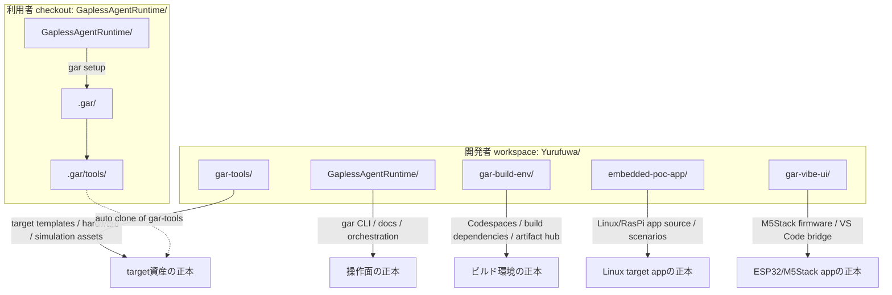
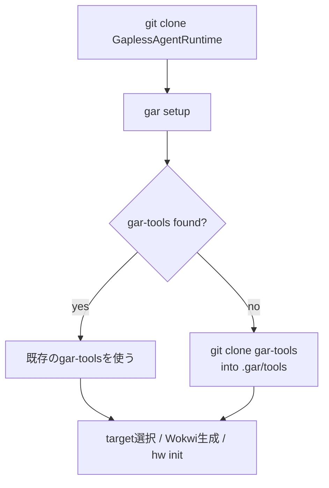
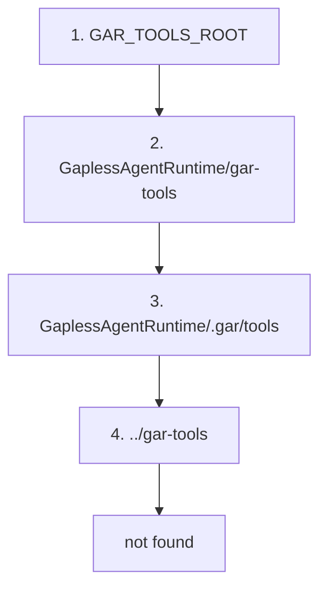
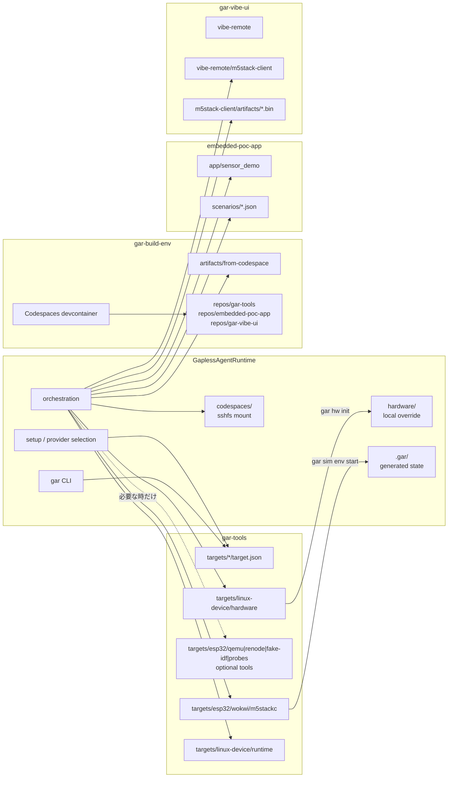
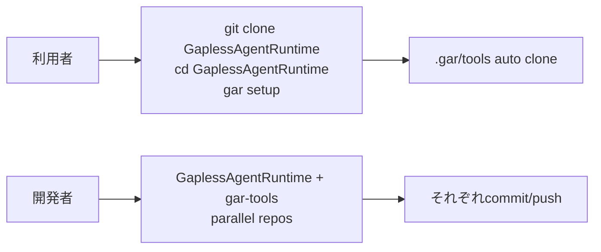

# リポジトリ配置と資産の置き場所

この資料は、`GaplessAgentRuntime`、`gar-tools`、`gar-build-env`、target app repo の関係を説明する。

結論として、開発時は兄弟リポジトリとして並べて編集し、利用時は `gar setup`
が `GaplessAgentRuntime/.gar/tools` に `gar-tools` を取得できる構成にする。

---

## 全体像



---

## 開発時の配置

開発者は `GaplessAgentRuntime`、`gar-tools`、`gar-build-env`、target app repo を普通のGitリポジトリとして並べる。
この形だと、それぞれを独立して差分確認、commit、pushしやすい。


代表的な配置:

```text
Yurufuwa/
  GaplessAgentRuntime/
  gar-tools/
  gar-build-env/
  embedded-poc-app/
  gar-vibe-ui/
```

---

## 利用時の配置

利用者は `GaplessAgentRuntime` だけをcloneして始められる。
`gar setup` は `gar-tools` が見つからない場合、`.gar/tools` に取得する。



利用者側の生成後イメージ:

```text
GaplessAgentRuntime/
  .gar/
    config.json
    tools/                  # gar setup が取得する gar-tools
    wokwi/
      m5stackc/             # Wokwi project generated from gar-tools
  codespaces/               # gar code start が作る sshfs mount（必要時）
  hardware/                 # gar hw init で作るローカル上書き（必要時）
  scripts/
  docs/
```

`.gar/` はローカル状態と生成物の置き場なので、Git管理しない。
アプリケーションのソースは `GaplessAgentRuntime/app` には置かず、
target app repo（例: `../embedded-poc-app/app`、`../gar-vibe-ui/vibe-remote/m5stack-client`）を正本にする。

---

## 探索順

`GaplessAgentRuntime` は、次の順番で `gar-tools` を探す。



この順番にしている理由:

| 順位 | 場所 | 意図 |
|---:|---|---|
| 1 | `GAR_TOOLS_ROOT` | 開発者・CIが明示した場所を最優先する |
| 2 | `GaplessAgentRuntime/gar-tools` | 手動で内側に置いた構成を許容する |
| 3 | `GaplessAgentRuntime/.gar/tools` | `gar setup` の自動取得先 |
| 4 | `../gar-tools` | 開発時の兄弟リポジトリ配置 |

---

## 資産の責務



責務の分け方:

| 種類 | 正本 | ローカル生成先 |
|---|---|---|
| target manifest | `gar-tools/targets/*/target.json` | なし |
| Wokwi project template | `gar-tools/targets/esp32/wokwi/m5stackc/` | `.gar/wokwi/m5stackc/` |
| ESP32 optional tools | `gar-tools/targets/esp32/{qemu,renode,fake-idf,probes}/` | 必要時のみ |
| Linux hardware CSV template | `gar-tools/targets/linux-device/hardware/` | `hardware/` |
| target app source | `embedded-poc-app/app/` | build artifact |
| app scenario | `embedded-poc-app/scenarios/` | remote scenario copy |
| Codespaces build hub | `gar-build-env/` | `codespaces/` sshfs mount |
| ESP32/M5Stack firmware source | `gar-vibe-ui/vibe-remote/m5stack-client/` | `.bin` artifact |
| ESP32/M5Stack firmware artifact | `gar-vibe-ui/vibe-remote/m5stack-client/artifacts/` | flash input |
| Runtime state / logs | なし | `.gar/` |

`hardware/` はプロジェクト固有の上書きとして扱う。標準テンプレートの正本は
`gar-tools` 側に置く。
`app/` は target app repo の責務なので、`GaplessAgentRuntime` には置かない。
`codespaces/` は `gar code start` が作るローカル mount なので、正本ではなく一時的な視界として扱う。

---

## なぜ submodule にしないか



Git submodule にすると、利用者が `--recurse-submodules` や
`git submodule update --init` を意識する必要が出る。GARの狙いはセットアップを
`gar setup` に集約することなので、submodule より `.gar/tools` 自動取得のほうが
操作モデルが単純になる。
