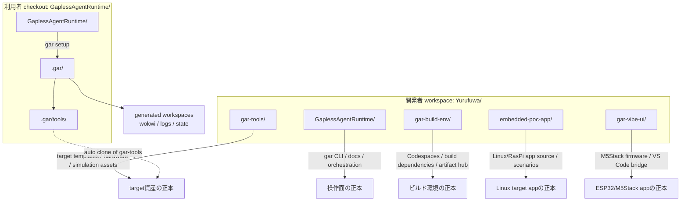
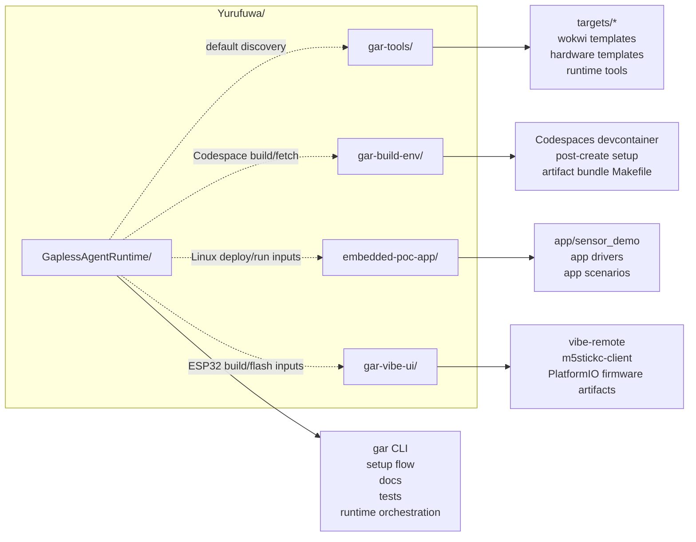
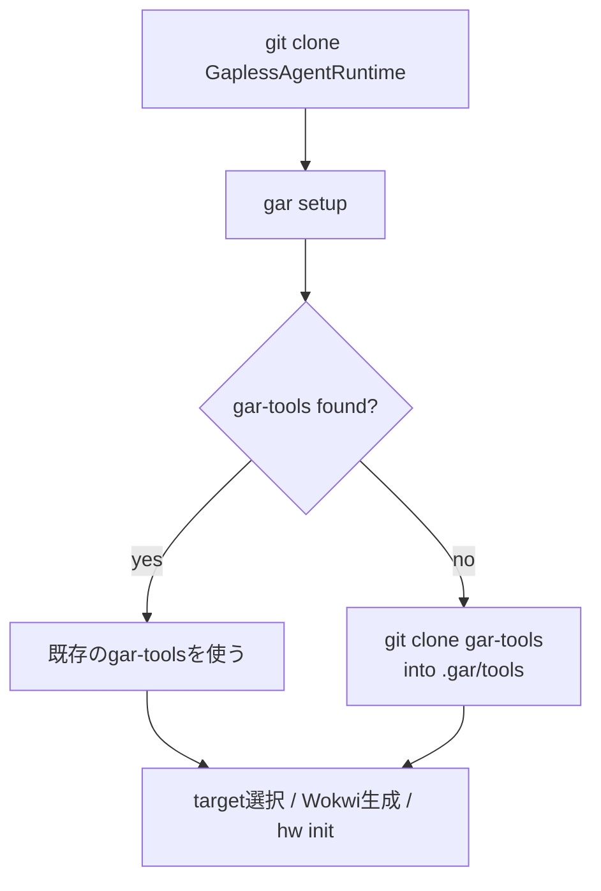
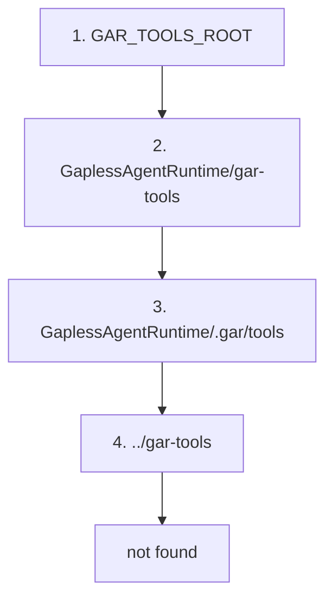
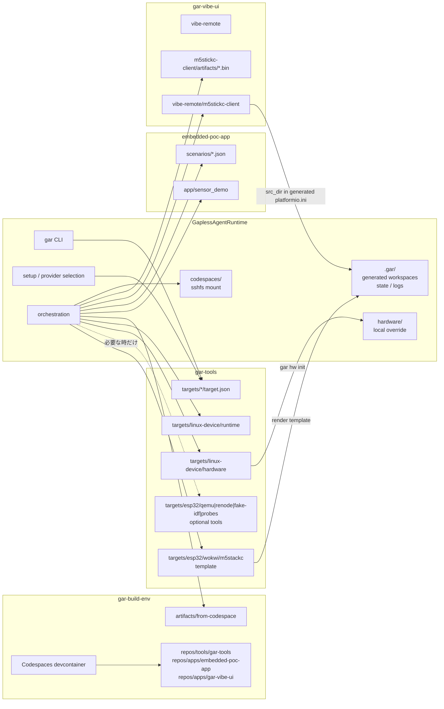
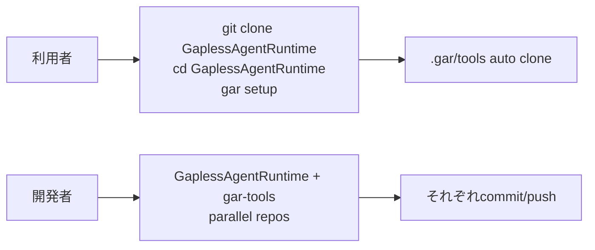

# リポジトリ配置と資産の置き場所

この資料は、`GaplessAgentRuntime`、`gar-tools`、`gar-build-env`、target app repo の関係を説明する。

結論として、開発時は兄弟リポジトリとして並べて編集し、利用時は `gar setup`
が `GaplessAgentRuntime/.gar/tools` に `gar-tools` を取得できる構成にする。

---

## 全体像



---

## GaplessAgentRuntime 内部構成

`GaplessAgentRuntime` は、target app のソースや target 固有テンプレートを持つ
リポジトリではなく、AI / 人間 / CI が各環境を同じ操作モデルで動かすための
**操作面 runtime** として設計する。

そのため、ディレクトリは大きく次の責務に分かれる。

```text
GaplessAgentRuntime/
  .gar/                    # local state / generated workspace / auto-cloned tools
  .venv/                   # local Python virtualenv
  docs/                    # operational docs and command references
  info/                    # product concept / design philosophy / future notes
  infra/                   # cloud infrastructure definitions for simulation hosts
  scripts/                 # gar CLI entrypoint and Python implementation
  tests/                   # unittest-based regression tests
  tools/                   # local helper tools bundled with GAR
  codespaces/              # optional sshfs mount created by `gar code start`
  hardware/                # optional local hardware CSV overrides
  Makefile                 # bootstrap and convenience entrypoints
  pyproject.toml           # Python lint/tool config
  requirements-gar.txt     # gar CLI runtime dependencies
```

| パス | Git管理 | 役割 | 設計上の位置づけ |
|---|---:|---|---|
| `scripts/gar` | yes | `gar` executable wrapper。venv を用意し、`scripts.gar_lib.cli` へ委譲する | 人間/AI が最初に触る薄い起動口 |
| `scripts/gar_lib/` | yes | GAR CLI の本体実装 | 操作面 runtime の正本 |
| `scripts/gar_lib/environments/` | yes | development / simulation / target access provider の IF と registry | `gar setup` の選択結果で差し替える拡張点 |
| `scripts/gar_lib/sim/` | yes | simulation runtime の domain logic | provider 差し替え後も共通に使う simulation 操作 |
| `scripts/run_scenario.py` | yes | JSON scenario を bridge API へ流す補助スクリプト | AI / CI が再現可能な検証入口 |
| `docs/` | yes | 操作手順、コマンド、環境境界、引き継ぎ | 利用者が実行するための正本 |
| `info/` | yes | 背景思想、製品仮説、将来像 | なぜこの構成かを説明する非手順ドキュメント |
| `infra/terraform/` | yes | EC2 simulation host を作る Terraform と bootstrap script | simulation host のインフラ正本 |
| `tools/vscode-gar/` | yes | VS Code terminal bridge extension | AI から VS Code terminal へ依頼を渡すローカル補助 |
| `tools/gar-mcp/` | yes | GAR MCP server | 外部 agent / tool 連携用の入口 |
| `tools/*.sh` | yes | 旧コマンド互換・補助スクリプト | 主要操作は `gar` へ集約し、ここは薄く保つ |
| `tests/` | yes | CLI / provider discovery / MCP の regression tests | 実装変更時の挙動固定 |
| `Makefile` | yes | `make init` / `make start` などの bootstrap | 初回導入と日常開始の入口 |
| `pyproject.toml` | yes | Ruff 設定 | Python 実装の静的品質設定 |
| `requirements-gar.txt` | yes | `argcomplete` など CLI 実行に必要な依存 | GAR 自体の最小依存 |
| `.gar/` | no | `config.json`、terminal request、generated workspace、`.gar/tools` | machine-local state。正本ではない |
| `.venv/` | no | `make init` / `scripts/gar` が作る Python venv | local execution cache |
| `codespaces/` | no | `gar code start` が作る sshfs mount | Codespace の一時的な視界。正本ではない |
| `hardware/` | no/任意 | `gar hw init` が作るローカル hardware CSV override | target 標準値からのプロジェクト固有上書き |

`app/` を置かないことが重要である。アプリケーションの正本は
`embedded-poc-app` や `gar-vibe-ui` のような target app repo にあり、GAR は
その artifact を build / simulation / target access provider へ運ぶ。

---

## `scripts/gar_lib` の分割

`scripts/gar_lib` は `gar` CLI の実装本体だが、1ファイルに詰め込まず、
コマンド領域と差し替え IF ごとに分割する。

```text
scripts/gar_lib/
  cli.py                  # argparse parser and top-level dispatch
  config.py               # .gar/config.json and project paths
  commands/
    code.py               # `gar code` command dispatcher and Codespaces helpers
    deploy.py             # artifact fetch/deploy for simulation/target access
    hw.py                 # hardware template initialization
    infra.py              # Terraform wrapper for simulation infra
    setup.py              # target/provider selection and dependency checks
    shim.py               # provider/target adapter artifact build command
    sim.py                # `gar sim env ...` orchestration
    terminal.py           # VS Code terminal request writer
    usb.py                # usbipd / USB helper command
    esp32_firmware.py     # ESP32 firmware artifact fetch / build helpers
  gar_tools.py            # gar-tools target manifest discovery
  environments/
  vscode/
    terminal_ui.py        # shared terminal UI helpers
    profile_manage.py     # VS Code terminal profile write/remove
    terminal_bridge.py    # VS Code Terminal Bridge extension install
  sim/
    parse.py              # parsers for simulation diagnostics
```

役割の分け方は次の通り。

| 種類 | ファイル/ディレクトリ | 責務 |
|---|---|---|
| CLI 表面 | `cli.py` | argparse の shape と各 command module への dispatch |
| ローカル状態 | `config.py` | `.gar/config.json` の load/save、既定値、project root |
| 初期設定 | `commands/setup.py` | target 選択、development/simulation/target access provider 選択、依存コマンド確認 |
| target 定義 | `gar_tools.py` | `gar-tools/targets/*/target.json` の探索と auto clone |
| development 環境 | `commands/code.py` + `environments/registry/development/*` | build/development target への接続。`gar setup` の development provider に委譲する |
| simulation 環境 | `commands/sim.py` + `sim/*` + `environments/registry/simulation/*` | VM / Wokwi / Renode 等の simulation runtime 操作 |
| target access provider | `commands/deploy.py` + `environments/registry/target_access/*` | 実機への artifact 配置、ADB/SSH/esptool 等の接続方式差し替え |
| target 固有処理 | `commands/esp32_firmware.py` | ESP32 の firmware artifact / build など target 固有の補助処理 |
| インフラ | `commands/infra.py`, `environments/registry/simulation/aws_ec2.py` | EC2 instance 操作と Terraform 実行 |
| ローカル補助 | `commands/terminal.py`, `commands/usb.py`, `vscode/profile_manage.py`, `vscode/terminal_bridge.py`, `vscode/terminal_ui.py` | VS Code terminal bridge、settings、USB、表示 |

`cli.py` は command line の形を決める場所に留め、環境固有の処理は
provider / command module へ寄せる。たとえば `gar code` は `cli.py` から
`run_code_command()` に渡り、そこで `selected_providers.development` の
`DevEnvironment.code_command()` へ委譲する。Codespaces 固有の `gh codespace`
処理は `github_codespaces` provider から呼ばれる。

---

## Provider registry の考え方

環境差し替えは `scripts/gar_lib/environments/` に集約する。

```text
scripts/gar_lib/environments/
  base.py                 # DevEnvironment base class and provider IF
  discovery.py            # registry package scan and category metadata
  registry/
    development/
      github_codespaces.py
      local.py
    simulation/
      aws_ec2.py
      ssh_remote.py
      wokwi.py
      renode_mcu.py
      esp32_qemu.py
      aws_ssm.py
      vibe_remote_device.py
    target_access/
      adb_usb.py
      adb_win.py
      esp32_esptool.py
      ssh_scp.py
```

`gar setup` は provider を category ごとに選び、`.gar/config.json` の
`selected_providers` に保存する。

| category | 代表 provider | 使われる主な command |
|---|---|---|
| `development` | `github_codespaces`, `local` | `gar code ...`, target build/fetch |
| `simulation` | `ssh_remote`, `wokwi`, `renode_mcu`, `esp32_qemu_firmware` | `gar sim env ...`, `gar sim deploy` |
| `target_access` | `adb_usb`, `adb_win`, `ssh_scp`, `esp32_esptool` | `gar target deploy`, `gar target flash/build` |

設計意図は、CLI の利用者には同じ `gar code` / `gar sim` / `gar target` を見せ、
実際の接続方式だけを provider で差し替えることにある。
`target_access` に置くのは target 種別そのものではなく、ADB / SSH / esptool など
「実機 target へどう到達するか」の provider である。

そのため、新しい接続先を増やすときは既存 command を増殖させるのではなく、
`environments/registry/<category>/`（実機接続では `target_access/`）に provider を追加する。

---

## Simulation domain logic

`scripts/gar_lib/sim/` は simulation provider の背後にある domain logic を置く。

```text
scripts/gar_lib/sim/
  base.py                 # SimProvider interface
  linux.py                # Linux/systemd compatible runtime command builder
  wokwi.py                # Wokwi workspace / command helper
```

ここは「どの transport で接続するか」ではなく、「simulation runtime をどう起動し、
どう診断し、どう GPIO/I2C/SPI bridge と話すか」を扱う。たとえば SSH 接続でも
AWS SSM 接続でも、Linux/systemd runtime の操作はできるだけ同じ builder を使う。

---

## Local/generated directories

次のディレクトリは利用時に生成されるか、環境依存の一時状態を置く。
Git の正本として扱わない。

| パス | 作られるタイミング | 中身 |
|---|---|---|
| `.gar/config.json` | `gar setup` | target、provider、host、serial port などの local config |
| `.gar/tools/` | `gar setup` | `gar-tools` が見つからない場合の auto clone 先 |
| `.gar/wokwi/` | Wokwi workspace 生成時 | template から展開した runnable workspace |
| `.gar/terminal-requests/` | `gar terminal run` / setup handoff | VS Code terminal bridge への実行要求 JSON |
| `.gar/mcp-config.json` | `make init` | MCP server 設定例 |
| `.venv/` | `make init` または `scripts/gar` 初回実行 | GAR CLI 用 Python venv |
| `codespaces/` | `gar code start` | Codespaces workspace の sshfs mount |
| `hardware/` | `gar hw init` | target hardware CSV のローカル上書き |

この分離により、同じ repository checkout を使っても、ユーザーごとの provider 選択や
接続先、生成 workspace は Git の差分として混ざらない。

---

## 開発時の配置

開発者は `GaplessAgentRuntime`、`gar-tools`、`gar-build-env`、target app repo を普通のGitリポジトリとして並べる。
この形だと、それぞれを独立して差分確認、commit、pushしやすい。



代表的な配置:

```text
Yurufuwa/
  GaplessAgentRuntime/
  gar-tools/
  gar-build-env/
  embedded-poc-app/
  gar-vibe-ui/
```

---

## 利用時の配置

利用者は `GaplessAgentRuntime` だけをcloneして始められる。
`gar setup` は `gar-tools` が見つからない場合、`.gar/tools` に取得する。



利用者側の生成後イメージ:

```text
GaplessAgentRuntime/
  .gar/
    config.json
    tools/                  # gar setup が取得する gar-tools
    wokwi/
      m5stackc/             # generated Wokwi workspace
  codespaces/               # gar code start が作る sshfs mount（必要時）
  hardware/                 # gar hw init で作るローカル上書き（必要時）
  scripts/
  docs/
```

`.gar/` はローカル状態、外部ツール、テンプレート展開済み workspace、ログの置き場なので、Git管理しない。
アプリケーションのソースは `GaplessAgentRuntime/app` には置かず、
target app repo（例: `../embedded-poc-app/app`、`../gar-vibe-ui/vibe-remote/m5stickc-client`）を正本にする。

---

## 探索順

`GaplessAgentRuntime` は、次の順番で `gar-tools` を探す。



この順番にしている理由:

| 順位 | 場所 | 意図 |
|---:|---|---|
| 1 | `GAR_TOOLS_ROOT` | 開発者・CIが明示した場所を最優先する |
| 2 | `GaplessAgentRuntime/gar-tools` | 手動で内側に置いた構成を許容する |
| 3 | `GaplessAgentRuntime/.gar/tools` | `gar setup` の自動取得先 |
| 4 | `../gar-tools` | 開発時の兄弟リポジトリ配置 |

---

## 資産の責務



責務の分け方:

| 種類 | 正本 | ローカル生成先 |
|---|---|---|
| target manifest | `gar-tools/targets/*/target.json` | なし |
| Wokwi workspace template | `gar-tools/targets/esp32/wokwi/m5stackc/` | `.gar/wokwi/m5stackc/` |
| ESP32 optional tools | `gar-tools/targets/esp32/{qemu,renode,fake-idf,probes}/` | 必要時のみ |
| Linux hardware CSV template | `gar-tools/targets/linux-device/hardware/` | `hardware/` |
| target app source | `embedded-poc-app/app/` | build artifact |
| app scenario | `embedded-poc-app/scenarios/` | remote scenario copy |
| Codespaces build hub | `gar-build-env/` | `codespaces/` sshfs mount |
| ESP32/M5Stack firmware source | `gar-vibe-ui/vibe-remote/m5stickc-client/` | `.bin` artifact |
| ESP32/M5Stack firmware artifact | `gar-vibe-ui/vibe-remote/m5stickc-client/artifacts/` | flash input |
| Runtime state / logs | なし | `.gar/` |

`hardware/` はプロジェクト固有の上書きとして扱う。標準テンプレートの正本は
`gar-tools` 側に置く。
`app/` は target app repo の責務なので、`GaplessAgentRuntime` には置かない。
`codespaces/` は `gar code start` が作るローカル mount なので、正本ではなく一時的な視界として扱う。

Wokwi も同じ考え方にする。`gar-tools` は配線、shim、scenario、`*.template`
の正本だけを持つ。アプリソースは target app repo を参照し、GAR は両者を
`.gar/wokwi/<target>/` に展開して、VS Code Wokwi 拡張や `wokwi-cli` が読める
workspace を作る。展開ルールのアプリ固有入口は target app repo 側に置き、
Vibe Remote M5StickC では `gar-vibe-ui/vibe-remote/m5stickc-client/Makefile` の
`make wokwi-workspace` として明示する。

---

## なぜ submodule にしないか



Git submodule にすると、利用者が `--recurse-submodules` や
`git submodule update --init` を意識する必要が出る。GARの狙いはセットアップを
`gar setup` に集約することなので、submodule より `.gar/tools` 自動取得のほうが
操作モデルが単純になる。
