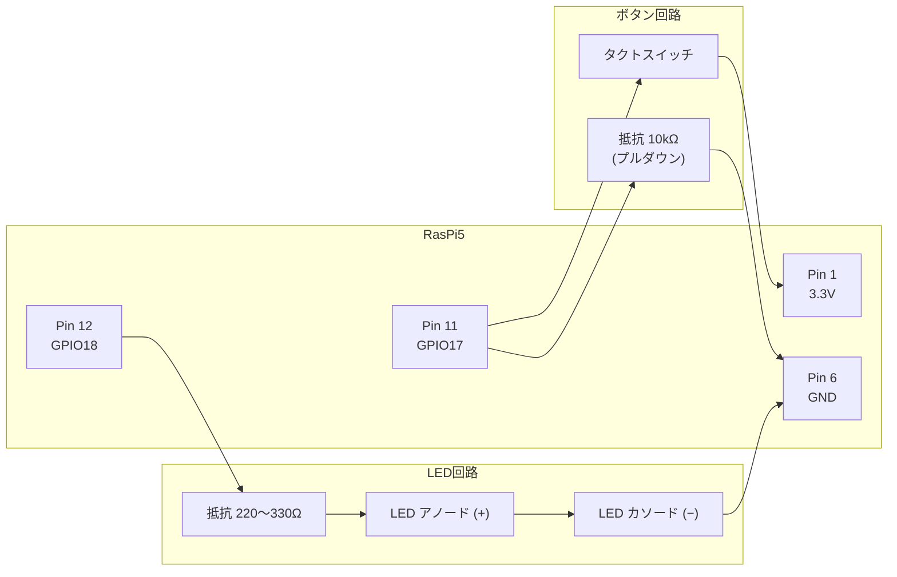

## LED + ボタン デモの配線

`gpio_led_button` を実機で動かすための配線。

```mermaid
flowchart LR
    subgraph RasPi5
        P1["Pin 1<br/>3.3V"]
        P6["Pin 6<br/>GND"]
        P11["Pin 11<br/>GPIO17"]
        P12["Pin 12<br/>GPIO18"]
    end

    subgraph LED回路
        R330["抵抗 220〜330Ω"]
        LED_A["LED アノード (+)"]
        LED_K["LED カソード (−)"]
    end

    subgraph ボタン回路
        SW1["タクトスイッチ"]
        R10k["抵抗 10kΩ<br/>(プルダウン)"]
    end

    P12 --> R330
    R330 --> LED_A
    LED_A --> LED_K
    LED_K --> P6

    P11 --> SW1
    SW1 --> P1
    P11 --> R10k
    R10k --> P6
```

- **LED 回路**: GPIO18 → 抵抗 → LED → GND（電流制限のために抵抗が必要）
- **ボタン回路**: 押すと GPIO17 が 3.3V に繋がる。押していない時は 10kΩ 抵抗で GND に落として 0V を維持（プルダウン）

---
