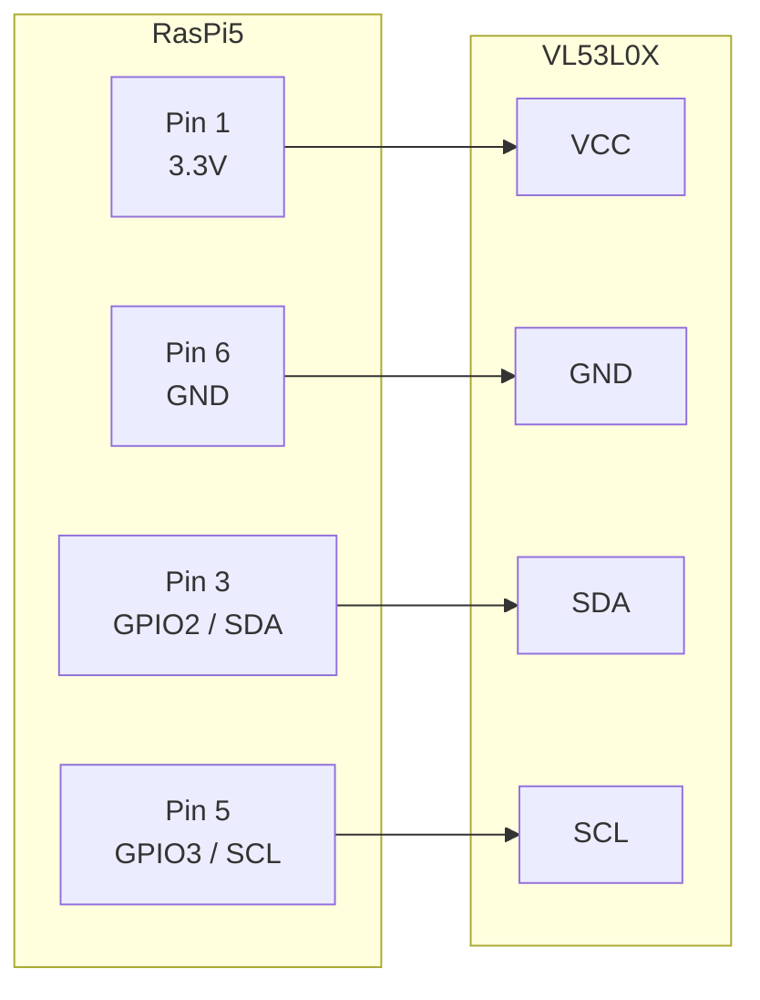

## VL53L0X（I2C 距離センサー）の配線

```mermaid
flowchart LR
    subgraph RasPi5
        P1["Pin 1<br/>3.3V"]
        P3["Pin 3<br/>GPIO2 / SDA"]
        P5["Pin 5<br/>GPIO3 / SCL"]
        P6["Pin 6<br/>GND"]
    end

    subgraph VL53L0X
        VCC
        GND
        SDA
        SCL
    end

    P1 --> VCC
    P6 --> GND
    P3 --> SDA
    P5 --> SCL
```

I2C はデフォルト無効。`sudo raspi-config nonint do_i2c 0 && sudo reboot` で有効化。

---
