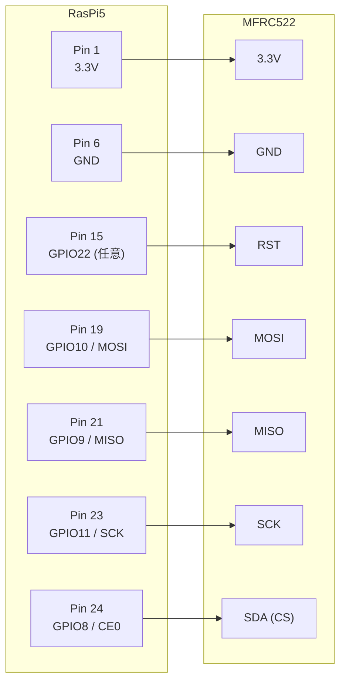

## MFRC-522（SPI RFID リーダー）の配線

```mermaid
flowchart LR
    subgraph RasPi5
        P1["Pin 1<br/>3.3V"]
        P6["Pin 6<br/>GND"]
        P15["Pin 15<br/>GPIO22 (任意)"]
        P19["Pin 19<br/>GPIO10 / MOSI"]
        P21["Pin 21<br/>GPIO9 / MISO"]
        P23["Pin 23<br/>GPIO11 / SCK"]
        P24["Pin 24<br/>GPIO8 / CE0"]
    end

    subgraph MFRC522
        M_VCC["3.3V"]
        M_GND["GND"]
        M_RST["RST"]
        M_MOSI["MOSI"]
        M_MISO["MISO"]
        M_SCK["SCK"]
        M_SDA["SDA (CS)"]
    end

    P1 --> M_VCC
    P6 --> M_GND
    P15 --> M_RST
    P19 --> M_MOSI
    P21 --> M_MISO
    P23 --> M_SCK
    P24 --> M_SDA
```

SPI も `sudo raspi-config nonint do_spi 0 && sudo reboot` で有効化。

---
